# Speedis (Gonzales)

<!--  -->

**Speedis is a High-Performance Shared HTTP Cache with Geographical Distribution Capability.**
In the implementation, the guidelines established in [RFC 9110](https://www.rfc-editor.org/rfc/rfc9111.html) on HTTP Semantics and [RFC 9111](https://www.rfc-editor.org/rfc/rfc9111.html) on HTTP Caching have been followed.
In the design of Speedis, special attention has been given to incorporating mechanisms to protect the origin servers against overloading.

Implementing a shared HTTP cache provides benefits among which the following are highlighted:
- **Reduced Latency**: A shared cache allows multiple clients or services to access the same cache, reducing the time spent fetching data from the origin server. This leads to faster response times and improved user experience.
- **Decreased Load on Origin Servers**: By caching frequently requested content, a shared cache reduces the number of requests that need to reach the origin server, lowering its load and ensuring better resource utilization.
- **Increased Efficiency**: Shared caches can serve data to multiple clients, maximizing the use of cached content and minimizing redundant data fetching from the origin server.
- **Improved Scalability**: A shared cache can easily scale as more clients or services are added, enabling consistent performance without overloading the origin infrastructure.
- **Cost Savings**: By reducing the number of origin server requests, shared caches can lower bandwidth and infrastructure costs, especially for high-traffic applications.
- **Consistency Across Multiple Clients**: Since the cache is shared, all clients access the same cached data, ensuring consistency in the responses and reducing discrepancies in what data is served.
- **Faster Content Delivery**: Shared caches, especially when distributed geographically, can serve content from locations closer to users, ensuring faster content delivery and reducing latency.

## Features

### Fast and lightweight
Speedis is built on top of the [Fastify](https://fastify.dev/) web framework to ensure high performance and efficient request handling.
This framework allows users to extend its functionality by implementing [plugins](https://fastify.dev/docs/latest/Reference/Plugins/).
The core of Speedis is developed as a Fastify plugin.
Speedis creates an instance of the plugin for each origin configuration file.
Requests are routed to the corresponding plugin instance using a prefix in the URL path.

### Shared storage backend
In a distributed HTTP caching system, a common issue arises when new instances are added to the cache pool.
If these instances do not share the same storage for cached objects (e.g., a shared backend or replication mechanism), they start in a “cold” state with no cached data.
As a result, these new instances must fetch content from the origin server, leading to increased latency and higher load on the backend until their cache is sufficiently populated.
This cold start problem in distributed HTTP Caches can cause inconsistencies in response times and reduce the overall effectiveness of the caching layer, especially during scaling events or instance replacements.
Mitigating this issue often requires cache warming techniques, consistent hashing strategies, or a shared storage backend.
Speedis mitigates this issue by using [Redis](https://redis.io/) as a shared storage backend, efficiently storing and retrieving cached responses.
This ensures that all instances can access the same cache data, preventing cold starts and reducing the need for multiple calls to the origin server.
Speedis leverages the [JSON capabilities](https://redis.io/docs/latest/develop/data-types/json/) available as an extension module in [Redis Stack](https://redis.io/docs/latest/operate/oss_and_stack/) and Redis Enterprise to store cache entries in JSON format.

For environments where the cache must comply with enterprise-grade standards (linear scalability, high availability, predictable performance, 24/7 support, etc.), using Redis Enterprise in any of its variants— the fully managed Redis database-as-a-service, [Redis Cloud](https://redis.io/cloud/) or the self-managed [Redis Software](https://redis.io/software/)— is highly recommended.

### Request coalescing
[Cache stampede](https://en.wikipedia.org/wiki/Cache_stampede) is a problem that occurs when multiple clients request the same resource simultaneously, but the cached version is expired or unavailable.
Since the cache does not contain a valid response, all requests are forwarded to the origin server at the same time, causing a sudden surge in load.
This can lead to performance degradation, increased latency, and even server overload.
Speedis implements request coalescing, a mechanism that prevents multiple identical requests from being sent to the origin server simultaneously.
When multiple clients request the same resource while it is being fetched, request coalescing ensures that only one request is forwarded to the origin, while the other requests wait for the response to be cached.
Once the response is available, all waiting requests reuse the cached result, reducing the load on the origin server and improving performance.
Speedis can not only coalesce requests arriving at a single instance but also coalesce requests across multiple instances.
It achieves it by implementing a [locking mechanism](https://en.wikipedia.org/wiki/Cache_stampede#Locking) using a [distributed lock pattern with Redis](https://redis.io/docs/latest/develop/use/patterns/distributed-locks/), ensuring maximum protection for the origin server.

### Handling Cache Origin Unavailability with Circuit Breaker
When the origin of the cache becomes unavailable (e.g., due to network failures, server downtime, or high latency), it can lead to several issues:
- **Increased Latency**: Requests that would normally be served from the cache must be redirected to the origin, causing higher response times.
- **Overloading the Origin**: Repeated failed attempts to fetch data from the origin can further burden an already overloaded or down server, exacerbating the problem.
- **Unreliable User Experience**: The cache’s inability to serve data can result in errors or poor performance, negatively impacting the user experience.
Speedis addresses these challenges by incorporating a circuit breaker mechanism.
This mechanism acts as a safeguard against repeated failed requests to the origin.
When the system detects a failure threshold (e.g., multiple failed requests within a short period), the circuit breaker opens and prevents further requests to the origin, thereby avoiding overloading the server.
Instead, it can return a default response or serve stale cached data, ensuring a more stable and reliable user experience even when the origin is unavailable.

### Clustering
Speedis implements clustering using Node’s built-in cluster module to fully utilize the potential of multi-core systems and enhance the performance of Node.js applications.
Clustering enables the creation of multiple worker processes to handle incoming requests, improving performance and optimizing system resource utilization.
By default, Speedis uses [os.availableParallelism()](https://nodejs.org/api/os.html#osavailableparallelism) to create as many workers as possible.

###  Geographically Distributed Cache
When the clients of a cache are geographically distributed, geographically distributing the cache itself provides additional benefits compared to a local cache, among which the following are highlighted:
- **Reduced Latency**: By placing cache instances closer to end users, geographically distributed caches can significantly reduce response times, improving the overall performance and user experience.
- **Improved Availability**: A distributed cache ensures high availability by replicating cached data across multiple locations. If one region or data center experiences issues, other regions can continue to serve requests, minimizing downtime.
- **Load Balancing**: Distributing the cache across multiple geographical locations helps balance the load, preventing any single server or data center from becoming a bottleneck and improving scalability.
- **Disaster Recovery**: In the event of a regional failure (e.g., network outage, power failure), the cache can continue to operate from other regions, ensuring service continuity and reducing the risk of downtime.
- **Scalability**: A geographically distributed cache can easily scale to meet growing demands by adding more cache nodes in various locations, providing a seamless way to expand without a major overhaul.
As previously mentioned, Speedis uses Redis to store cache entries.
The Redis Enterprise versions offer [Active-Active geo-distributed databases](https://redis.io/docs/latest/operate/rs/databases/active-active/).
With Active-Active databases, applications can read and write to the same data set from different geographical locations seamlessly and with latency less than one millisecond (ms), without changing the way the application connects to the database.
The features of these databases make it easier to geographically distribute Speedis instances, so that each instance can connect by default to the nearest replica of the database.
This way, all the benefits outlined earlier in this section and in the ‘Shared Storage Backend’ section are achieved.
Additionally, in case of issues between Speedis instances and Redis, the instances can temporarily connect to any of the other replicas of the database, maintaining service continuity.

### Observability
The application exposes operational metrics using Prometheus, a powerful open-source monitoring and alerting toolkit. These metrics provide valuable insights into the performance, health, and resource usage of the application, enabling proactive monitoring and troubleshooting. Prometheus can scrape these metrics at regular intervals, allowing for the collection, storage, and visualization of key performance data in real time.

## Speedis main configuration
The file ./conf/speedis.conf contains a JSON object with the general configuration of the Speedis server.
The following table describes the supported fields.

|Field|Type|Mandatory|Default|Description|
|-----|----|---------|-------|-----------|
|`maxNumberOfWorkers`|Number|`false`|[os.availableParallelism()](https://nodejs.org/api/os.html#osavailableparallelism)|This parameters limits the number of workers.|
|`port`|Number|`false`|3001|The port on which the main service is running.|
|`logLevel`|String|`false`|`info`|Logging level for the main service (`trace`, `debug`, `info`, `warn`, `error`, `fatal`).|
|`metricServerPort`|Number|`false`|3003|The port on which the metrics service is running.|
|`metricServerLogLevel`|String|`false`|`info`|Logging level for the metric service (`trace`, `debug`, `info`, `warn`, `error`, `fatal`).|

## Origins configurations
In Speedis, the remote server to be cached is referred to as an `origin`.
The configuration of Speedis’ behavior for each origin is defined in a configuration file which contains a JSON object and is located in ./conf/origin/.
During initialization, Speedis will load all configuration files located in that folder.
The following table describes the supported fields.
|Field|Type|Mandatory|Default|Description|
|-----|----|---------|-------|-----------|
|`id`|String|`true`||Origin’s ID|
|`prefix`|String|`true`||URL path prefix used to route incoming requests to this origin.|
|`logLevel`|String|`true`|`info`|Logging level for this origin (`trace`, `debug`, `info`, `warn`, `error`, `fatal`).|
|`exposeErrors`|Boolean|`false`|`false`|This parameter determines whether descriptive error messages are included in the response body (`true` or `false`).|
|`redis`|Object|`true`||Speedis uses [node-redis](https://github.com/redis/node-redis) to connect to the Redis database where the cached contents are stored. This object defines the connection details. Its format is almost identical to the [createClient configuration](https://github.com/redis/node-redis/blob/master/docs/client-configuration.md). The main difference is that, since the configuration is in JSON format, parameters defined as JavaScript entities in the original client configuration are not supported.|
|origin|Object|true||This object defines all the details related to the origin management. Its format is detailed below.|

### Origin configuration object
The following table describes the supported fields in the origin configuration object.
|Field|Type|Mandatory|Default|Description|
|-----|----|---------|-------|-----------|
|`httpxOptions`|Object|`true`||Speedis leverages Node’s native [http](https://nodejs.org/api/http.html)/[https](https://nodejs.org/api/https.html) libraries to make requests to the origin server. This field is used to define the request options. Its format is almost identical to the original [options](https://nodejs.org/api/http.html#httprequestoptions-callback). The main difference is that, since the configuration is in JSON format, parameters defined as JavaScript entities in the original options are not supported.|
|`agentOptions`|Object|`false`||Speedis allows to use an [Agent](https://nodejs.org/api/https.html#class-httpsagent) to manage connection persistence and reuse for HTTP clients. This field is used to configure the agent. Its format is identical to the original [https options](https://nodejs.org/api/https.html#class-httpsagent) or [http options](https://nodejs.org/api/http.html#new-agentoptions).|
|`fetchTimeout`|Number|`false`||Specifies the maximum time allowed for retrieving the resource from the origin server before the request is considered a failure.|
|`ignoredQueryParams`|[String]|`false`||The cache key is generated based on the URL requested from the origin. This field defines a list of query string parameters that will be ignored when forming the cache key for the entry.|
|`sortQueryParams`|Boolean|`false`|`false`|The cache key is generated based on the URL requested from the origin. This field determines whether the query string parameters should be sorted alphabetically before being used to generate the cache key for the entry (`true` or `false`). |
|`requestCoalescing`|Boolean|`false`|`false`|Enables (`true`) or disables (`false`) the request coalescing mechanism.|
|`lock`|Boolean|`false`|`true`|Enables (`true`) or disables (`false`) the request coalescing functionality across multiple instances.|
|`lockOptions`|Object|`true` if lock is enabled||Configure the distributed lock mechanism. Its format is detailed below.|
|`circuitBreaker`|Boolean|`false`|`true`|Enables (`true`) or disables (`false`) the circuit breaker mechanism.|
|`circuitBreakerOptions`|Object|`true` if circuitBreaker is enabled||Speedis leverages [Opossum](https://nodeshift.dev/opossum/) to implement the circuit breaker mechanism. This field is used to define the circuit braker options. Its format is almost identical to the original [options](https://nodeshift.dev/opossum/#circuitbreaker). The main difference is that, since the configuration is in JSON format, parameters defined as JavaScript entities in the original options are not supported.|

#### Lock configuration object
The following table describes the supported fields in the lock configuration object.
|Field|Type|Mandatory|Default|Description|
|-----|----|---------|-------|-----------|
|`lockTTL`|Number|`true`||(Time-to-Live for the lock): Specifies the duration (in milliseconds) for which the lock remains valid before automatically expiring. If the lock is not explicitly released within this period, it will be removed.|
|`retryCount`|Number|`true`||(Number of retry attempts): Defines the maximum number of times the system will attempt to acquire the lock if the initial attempt fails.|
|`retryDelay`|Number|`true`||(Base delay between retries): Sets the waiting time (in milliseconds) between consecutive lock acquisition attempts. This helps prevent excessive contention when multiple processes try to acquire the same lock.|
|`retryJitter`|Number|`true`||(Randomized delay variation): Introduces a random variation (in milliseconds) to the retry delay to reduce the likelihood of multiple processes retrying at the same time, which can help prevent contention spikes.|

#### Transformations configuration
Speedis supports transformations at different phases of a request:
- **ClientRequest**: Apply transformations to the request received by Speedis from the client (via HAProxy).
- **ClientResponse**: Apply transformations to the response sent by Speedis to the client (via HAProxy).
- **OriginRequest**: Apply transformations to the request sent by Speedis to the origin server.
- **OriginResponse**: Apply transformations to the response received by Speedis from the origin server.
- **CacheRequest**: Apply transformations to the request sent by Speedis to the cache (Redis).
- **CacheResponse**: Apply transformations to the response received by Speedis from the cache (Redis).
In each origin’s configuration file, you can define the transformation to be applied to the URL that matches a pattern defined by a regular expression.
The transformations will be applied according to the order in which they are defined.
```
    "transformations": [
        {
            "urlPattern": ".*",
            "actions": [
                {
                    "phase": "OriginRequest",
                    "uses":  "setHeaders",
                    "with": {
                        "x-header": "example of transformation"
                    }         
                }
            ]  
        } 
    ]
```
## Reverse proxy
Incorporating a reverse proxy is a [recommended practice](https://fastify.dev/docs/latest/Guides/Recommendations/#use-a-reverse-proxy).
In the specific case of Speedis, the main reasons for using it are to facilitate serving multiple domains and to handle TLS termination.
We propose using HAProxy as the reverse proxy and have included a configuration file example in ./conf/haproxy/haproxy.cfg.
In the HAProxy configuration file, the different domains being served are defined.
Depending on the domain through which a request is received, the request path sent to the origin is modified by adding the prefix of the plugin instance that will handle it.
Additionally, this folder contains a script to generate a self-signed certificate for the domain used in the configuration.
In the included example, the following workflow is defined

https://mocks.speedis/v1/items?x=1&y=2 -> http://speedis:3001/mocks/v1/items?x=1&y=2 -> http://mocks:3030/v1/items?x=1&y=2

Note: Proper DNS resolution is required for mocks.speedis, speedis, and mocks to function correctly.

## Getting Started

### **Prerequisites**  
Ensure you have the following installed:  
- [Docker](https://docs.docker.com/get-docker/)  
- [Docker Compose](https://docs.docker.com/compose/)
- [OpenSSL](https://www.openssl.org/)

### **Clone the repository**  
```sh
git clone https://github.com/mjguisado/speedis.git
cd speedis
```

### **Generate self signed certificate**
Generate self signed certificate to test HAProxy TLS termination
The test domain is mocks.speedis
```sh
./conf/haproxy/generate_self_signed_cert.sh
```

### **Start the environment**  
Run the following command to start all services:  
```sh
docker compose up --build -d
```
This will start:
- **Redis**: In-memory shared data storage
- **HAProxy**: Reverse Proxy
- **Speedis**: The main caching service
- **Mocks**: Mocked origin server
- **Prometheus**: Monitoring system
- **Grafana**: Visualization tool

### **Verify the setup**  
Check the running containers:  
```sh
docker ps
```
You should see all containers (`redis-stack-server`, `speedis`, `haproxy`, etc.) running.

### **Access Services**  
- **HAProxy** → `http(s)://localhost`  
- **Speedis** → `http://localhost:3001`
- **Speedis (Metrics)** → `http://localhost:3003/metrics`
- **Mocks** → `http://localhost:3030`
- **Grafana** → `http://localhost:3000` (User: `admin`, Password: `grafana`)  
- **Prometheus** → `http://localhost:9090`

### **Examples of requests**

#### **Request to the Mocked origin server**
```sh
curl -vXGET 'http://127.0.0.1:3030/mocks/items/RealBetis?delay=300&cc=public,max-age=10&a=alfa&b=beta&c='
```
#### **Request to Speedis**
```sh
curl -vXGET 'http://127.0.0.1:3001/mocks/mocks/items/RealBetis?delay=300&cc=public,max-age=10&a=alfa&b=beta&c='
```
Repeat the request several times to observe how the response headers (Age, X-Speedis-Cache-Status) indicate the cache status.
#### **HTTP Request to Speedis via HAProxy**
```sh
curl -vXGET -H 'Host: mocks.speedis' 'http://127.0.0.1/mocks/items/RealBetis?delay=300&cc=public,max-age=10&a=alfa&b=beta&c='
```
#### **HTTP Request to Speedis via HAProxy**
```sh
curl -vkXGET -H 'Host: mocks.speedis' 'https://127.0.0.1/mocks/items/RealBetis?delay=300&cc=public,max-age=10&a=alfa&b=beta&c='
```

### **Stopping the environment**  
To stop all containers, run:  
```sh
docker compose down
```
or to stop all containers and delete the Prometheus data volumen, run:  
```sh
docker compose down -v
```

## Request coalescing test
We are going to run some tests to observe the effects of the Request Coalescing mechanism on the origin.

### Without request coalescing
First, we modify the configuration file for the mocks origin, located at ./conf/origins/mocks.json, to ensure that the coalescing mechanisms are disabled—both for requests arriving at the same instance (requestCoalescing = false) and across different instances (lock = false).

Once modified, we proceed to start the environment:
```sh
docker compose up --build -d
```

To visualize the effects, we will use a dashboard that we will import into Grafana.

1. **Access Grafana at http://localhost:3000 (User: admin, Password: grafana).**

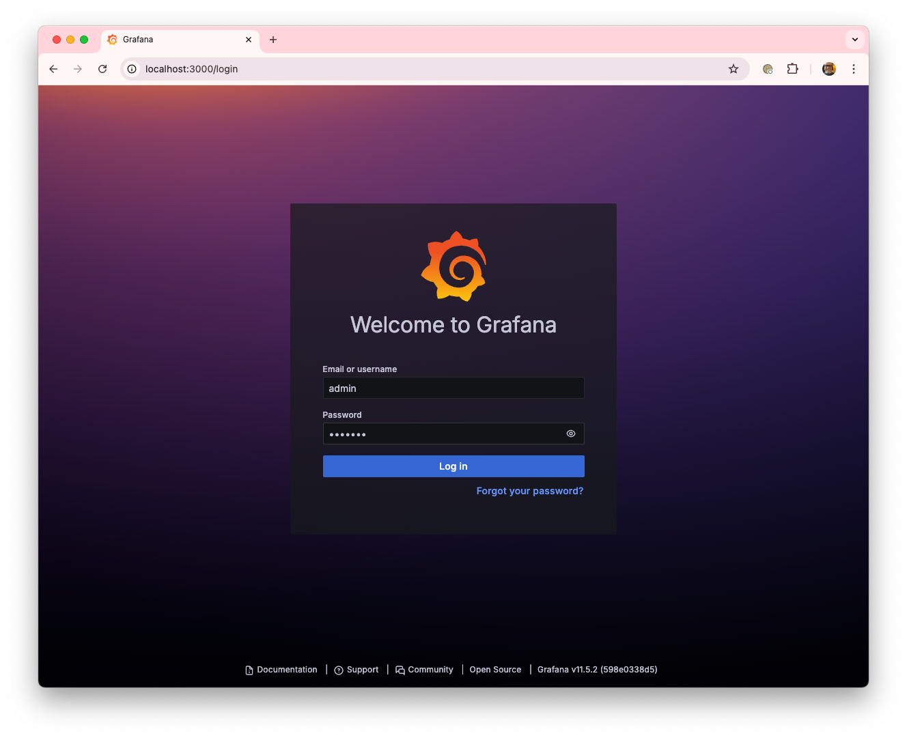

2. **Select the Dashboards option.**

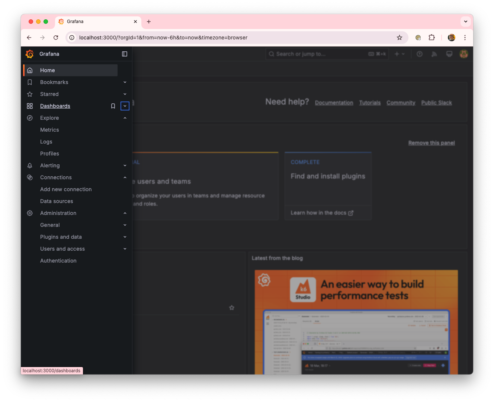

3. **Click on Import a new Dashboard.**

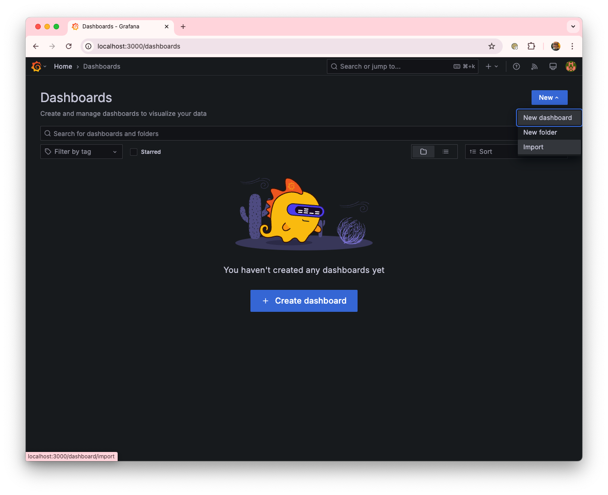

4. **Upload the contents of the ./conf/grafana/Speedis-dashboard.json file.**

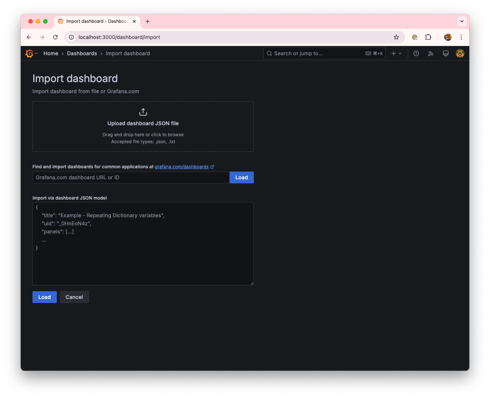

5. **Confirm the import.**

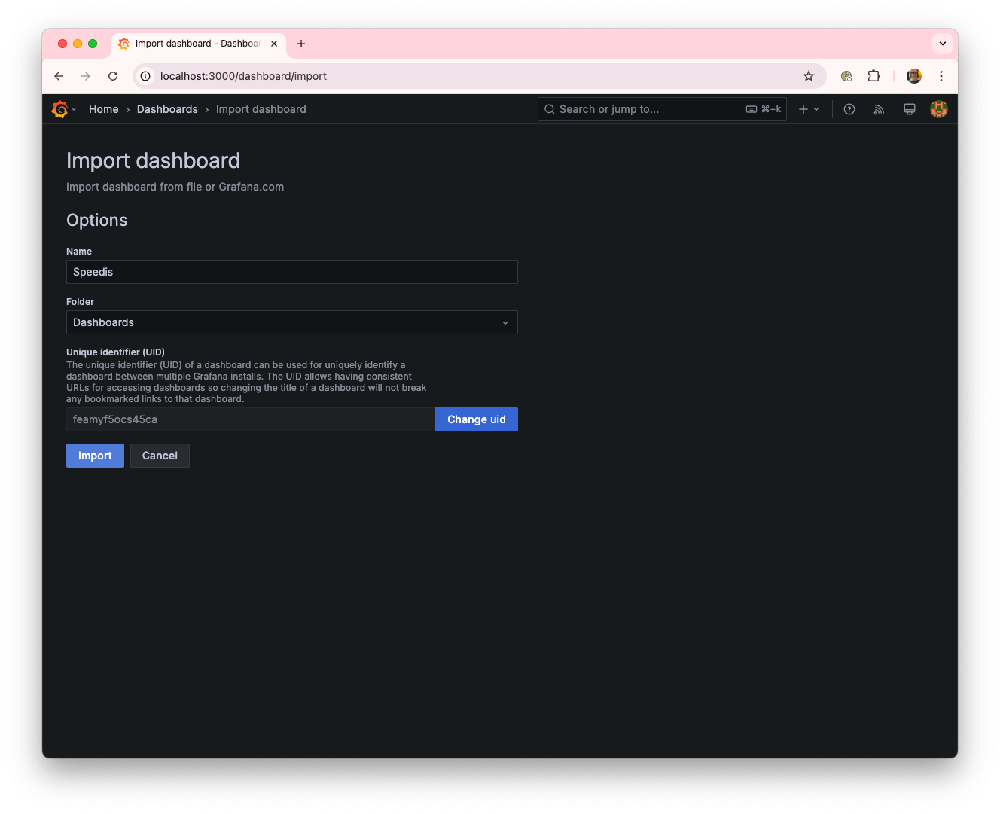

6. **Once imported, the dashboard will be available for use.**

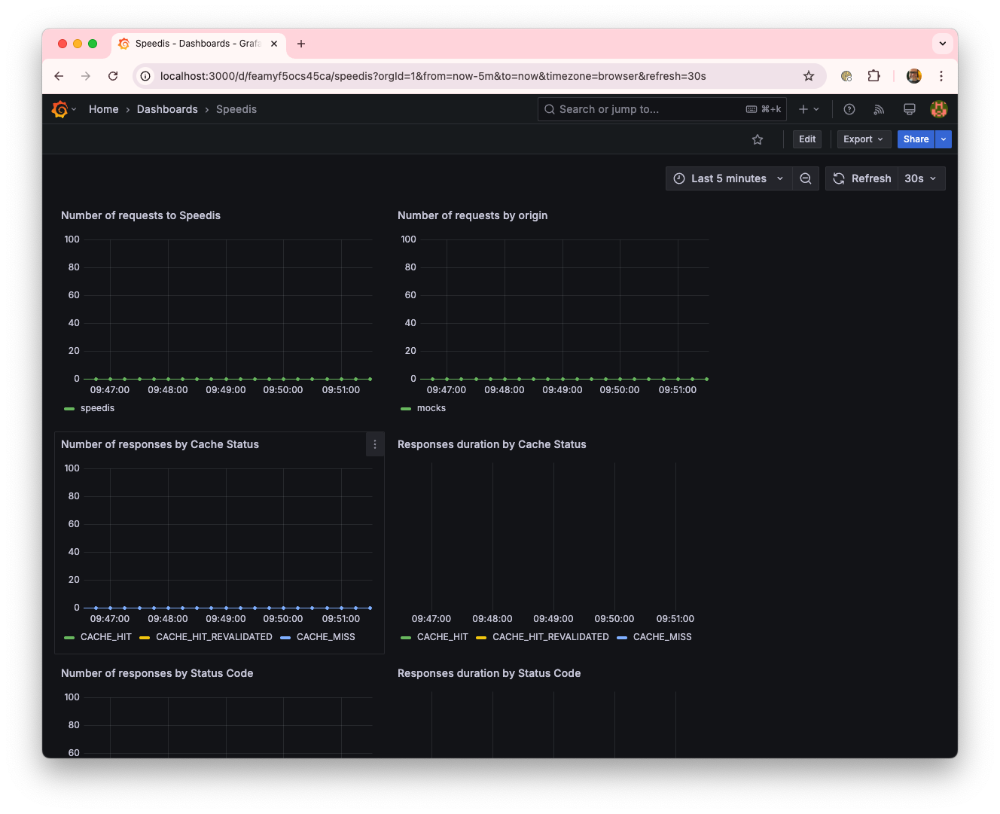

The next step is to generate load on the platform using [artillery](https://www.artillery.io/)
Specifically, we will use a scenario where 500 requests per second are sent to the same resource for 15 minutes.
```sh
artillery run --scenario-name 'overflow' ./artillery/load-test.yml
```
In the request sent to the mocks server (origin), we specify that the response should be delayed by 500ms and that it will remain valid in the cache for 5 seconds.

After the initial moments, the number of incoming requests to Speedis stabilizes at around 500 req/s, while the number of requests to the origin is significantly lower, at around 40-45 req/s. This translates to a workload reduction of more than 90% on the origin server for these requests. Additionally, the response time for requests reaching the origin remains around 500ms, as configured, whereas requests served from the cache have a significantly lower response time of approximately 30ms. This improvement is a direct result of using a cache.
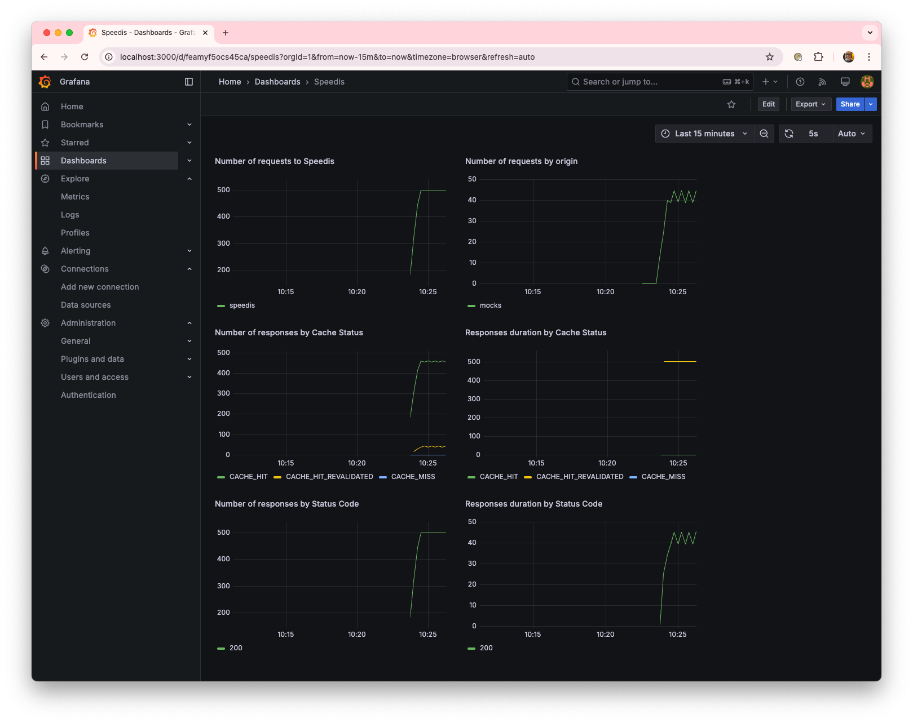

### Request coalescing at the same instance
Now, we modify the configuration to enable the coalescing mechanisms for requests arriving at the same instance (requestCoalescing = true) and restart the environment.
```sh
docker compose up --build -d
```

A further drastic reduction in the number of requests to the origin is observed, dropping from around 40 req/s to 0.35 req/s. Additionally, the response time for requests reaching the origin decreases from 500ms to 250ms, which contributes to lowering the average response time for all requests, reducing it from 40ms to 20ms.
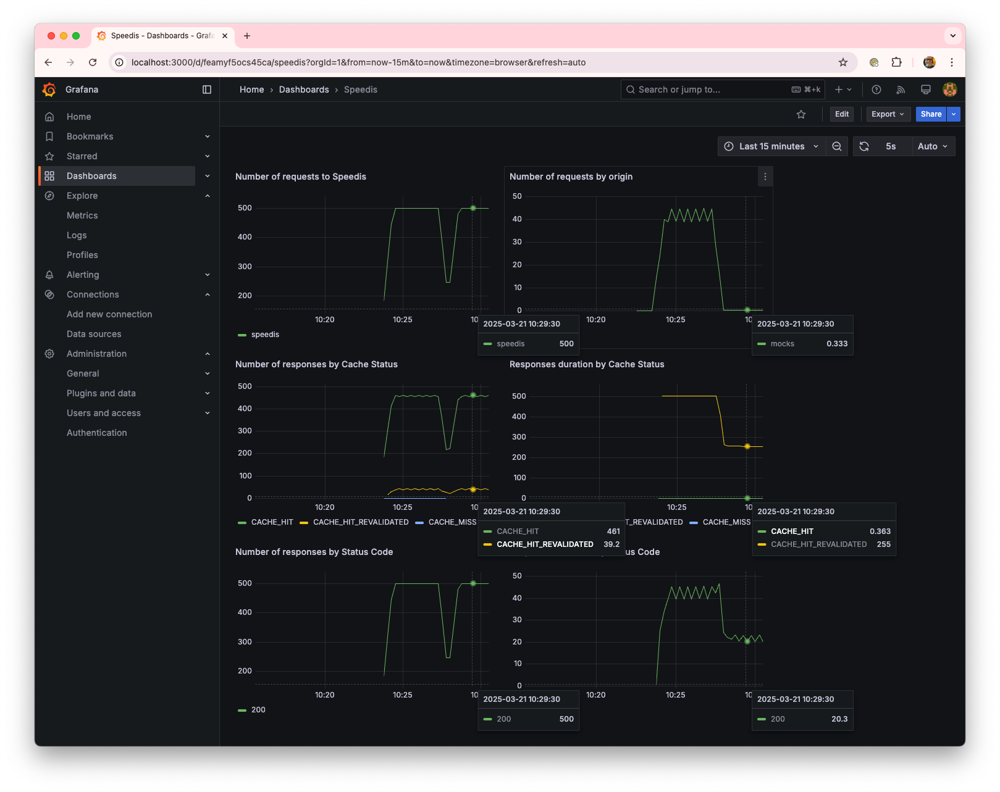
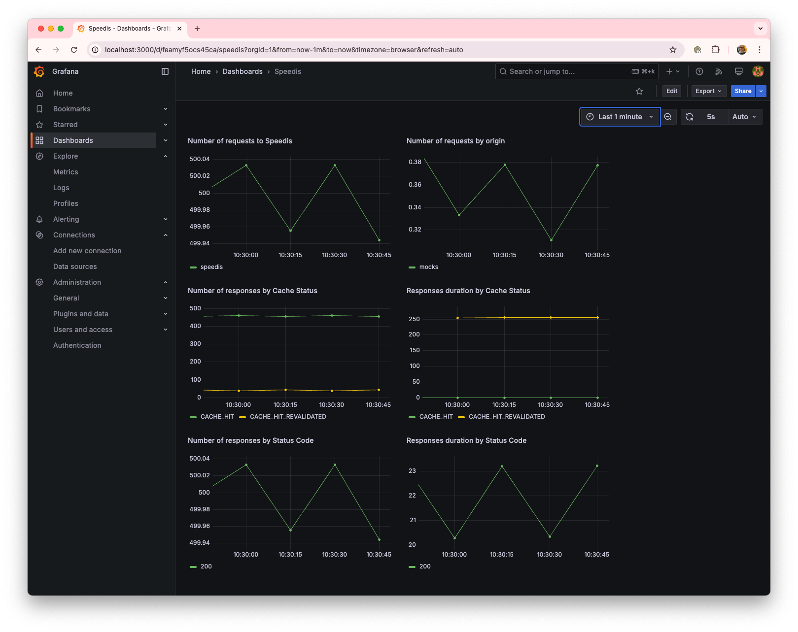

These results can be explained because the requests arriving at Speedis while the cached version had expired had to go to the origin (Cache stampede), leading to a response time slightly above the 500ms it takes the origin to respond. However, now all requests arriving while the first request that found the cached version expired is refreshing it will wait for the cache to be updated before reusing the value. The average wait time is distributed randomly between 0 and 500ms, which results in an average of 250ms, as observed in this scenario.

### Request coalescing across different instances
Finally, we modify the configuration to enable the coalescing mechanisms for requests arriving across different instances (lock = true) and restart the environment.
```sh
docker compose up --build -d
```

A further reduction in the number of requests to the origin is observed, with requests halving. However, the average response time increases.
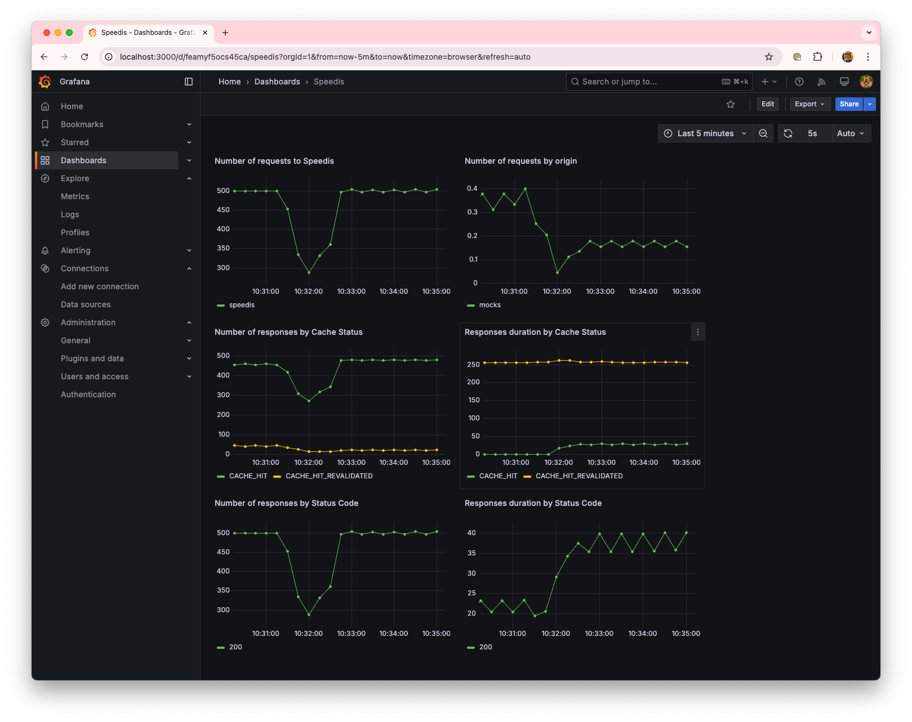

The halving of the number of requests is due to the fact that, in the environment where the tests are being run, the container running Speedis has launched two workers alongside the process managing the cluster.
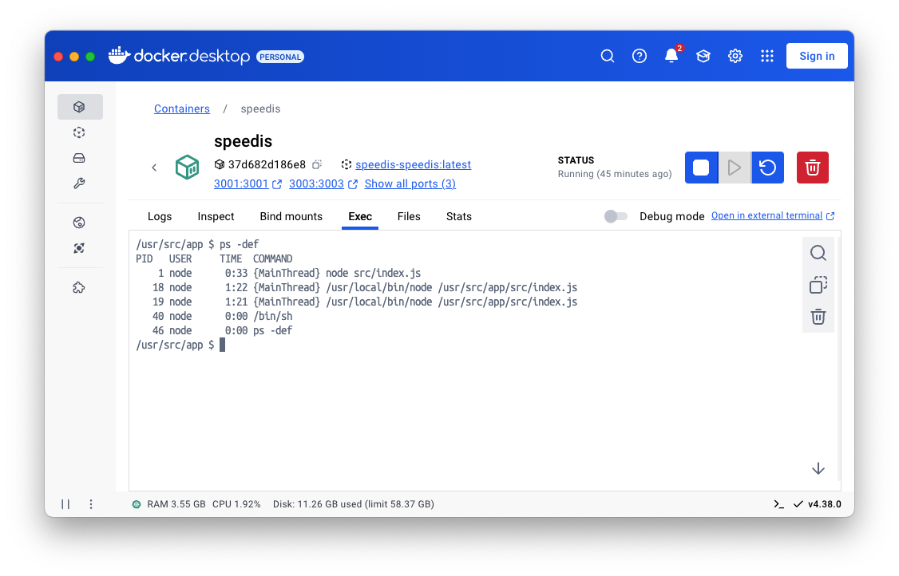

Each worker behaves as an independent instance, and by enabling the coalescing mechanisms across them, only one of the two makes requests to the origin, which results in halving the number of requests to the origin.

The increase in the response time of the requests is due to the fact that, unlike the coalescing mechanism within each instance, where requests waiting are notified that the cache has been updated, the distributed mechanism requires waiting for a period of time, defined by the delays, before checking if the data has been updated.

## Contributing
Contributions are welcome! Feel free to submit issues or pull requests.

## License
TBD


