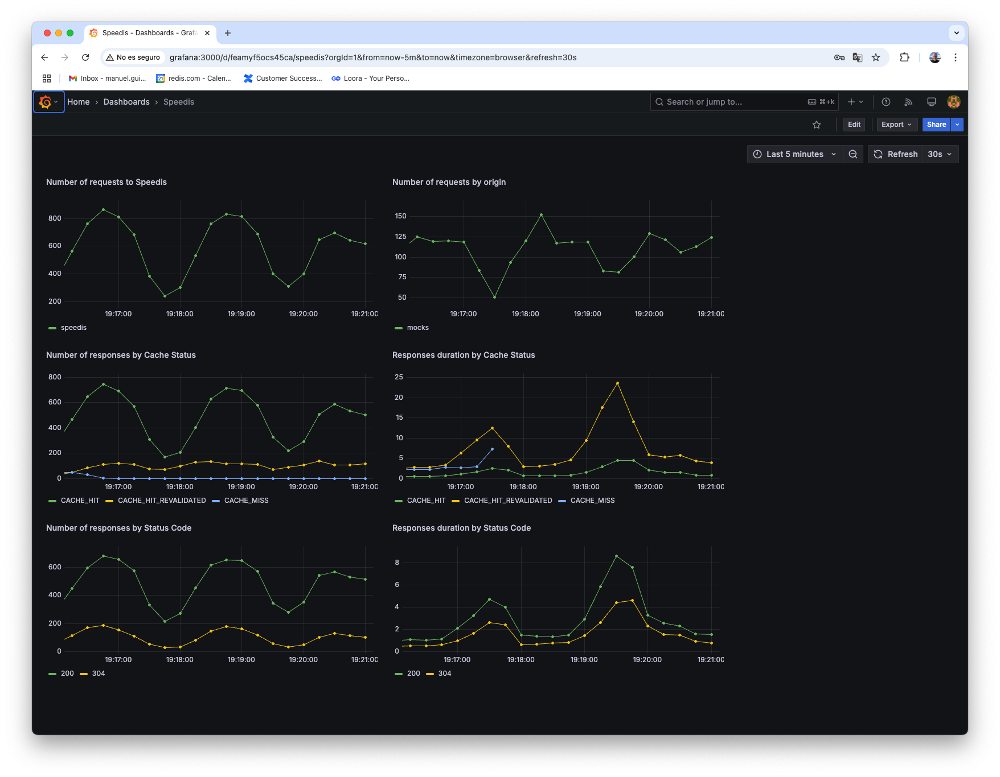

# Circuit breaker test
We are going to run some tests to observe the effects of the circuit breaker mechanism on the origin server.

## Without circuit breaker
First, we modify the configuration file for the mocks origin, located at ./conf/origins/mocks.json, to ensure that the circuit breaker mechanisms is disabled (circuitBreaker = false) and the coalescing mechanisms are enabled—both for requests arriving at the same instance (requestCoalescing = true) and across different instances (lock = true).

Once modified, we proceed to start the environment:
```sh
docker compose up --build -d
```
To visualize the effects, we will use a dashboard that we will import into Grafana.

Follow this [instructions to import](./Grafana.md) it into the grafana instance.

The next step is to generate load on the platform using [artillery](https://www.artillery.io/).
Specifically, we will use a scenario where, at a rate of 500 times per second, two requests are sent to the cache for 15 minutes.
For these tests, we use a scenario where the following flow is executed at a frequency of 500 times per second:
1. The first request is sent to a resource (URL) and is marked to remain valid in the cache for a random number of seconds between 1 and 60.
2. The system waits for a random number of seconds between 1 and 60.
3. A conditional request (If-Modified-Since) is sent to the same resource (URL).
```sh
artillery run --scenario-name '304' ./artillery/load-test.yml

```
After the initial minutes, the system shows behavior where the number of requests per second to Speedis varies between 200 and 800, to the origin between 50 and 150, and the response times for requests that need to go to the origin are below 25ms.


Then, we provoke an outage in the origin server.
```sh
docker stop mocks
```
And after some minutes we recover the origin server.
```sh
docker start mocks
```
In this case, during approximately the first minute of the 3-minute outage of the origin server, it is observed that the response time for requests served from the cache (**CACHE_HIT**) remains within the millisecond range.
However, requests start to appear that return cached content (**CACHE_HIT_NOT_REVALIDATED_STALE**) after exceeding the one-second timeout set as the limit for origin requests.
Additionally, we observe requests that return an error because they could not find a valid entry in the cache and exhausted all retries without successfully obtaining the necessary lock to access the origin (**CACHE_NO_LOCK**).
In both cases, the reponse times exceed one second.
Once the origin is restored, the system returns to normal.  


Finally, we modify the configuration file for the mocks origin to ensure that the circuit breaker mechanisms is enabled (circuitBreaker = true) and restart the environment.
```sh
docker compose up --build -d
```
We then repeat the previous process of stopping and starting the origin server after the initial stabilization period.
In this case, we observe that during the origin server outage, the circuit breaker mechanism is triggered, preventing requests from reaching the origin.  
As a result, the system returns the existing data from the cache without refreshing (**CACHE_HIT_NOT_REVALIDATED_STALE**), while keeping the response time within the millisecond range.  


