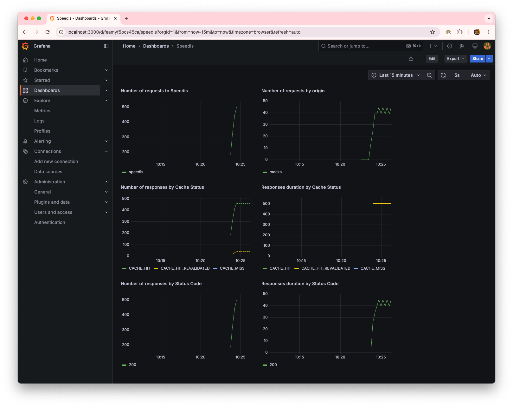
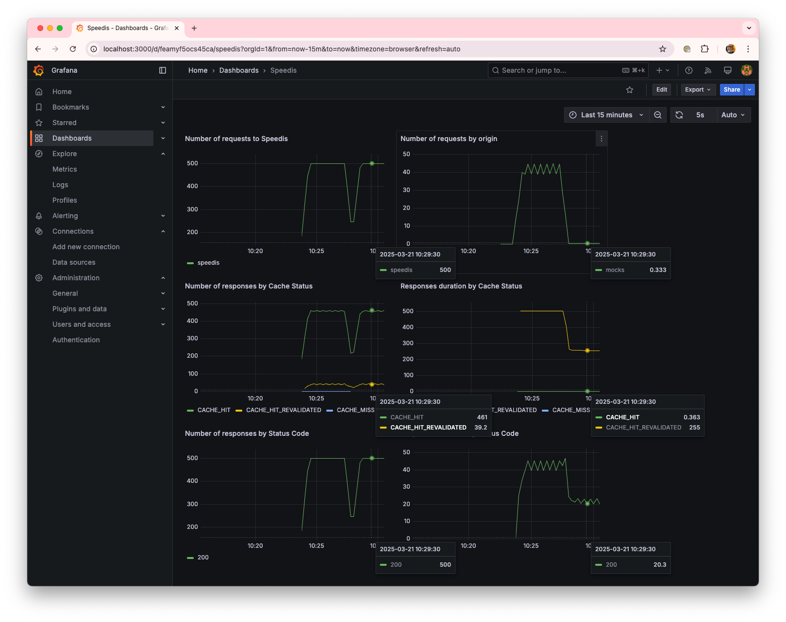
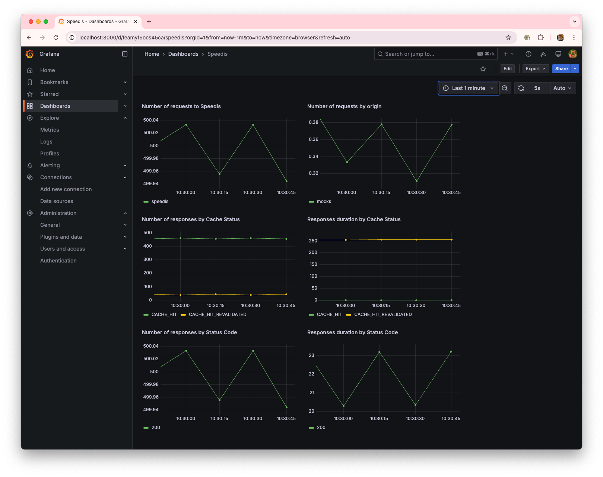
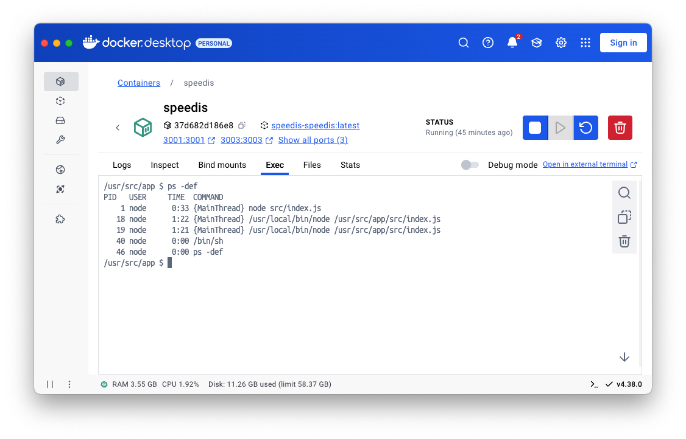

# Request coalescing test
We are going to run some tests to observe the effects of the Request Coalescing mechanism on the origin server.

## Without request coalescing
First, we modify the configuration file for the mocks origin, located at ./conf/origins/mocks.json, to ensure that the coalescing mechanisms are disabled—both for requests arriving at the same instance (requestCoalescing = false) and across different instances (lock = false).

Once modified, we proceed to start the environment:
```sh
docker compose up --build -d
```
To visualize the effects, we will use a dashboard that we will import into Grafana.

Follow this [instructions to import](./Grafana.md) it into the grafana instance.

The next step is to generate load on the platform using [artillery](https://www.artillery.io/).
Specifically, we will use a scenario where 500 requests per second are sent to the same resource for 15 minutes.
```sh
artillery run --scenario-name 'overflow' ./artillery/load-test.yml
```
In the request sent to the mocks server (origin), we specify that the response should be delayed by 500ms and that it will remain valid in the cache for 5 seconds.

After the initial moments, the number of incoming requests to Speedis stabilizes at around 500 req/s, while the number of requests to the origin is significantly lower, at around 40-45 req/s. This translates to a workload reduction of more than 90% on the origin server for these requests. Additionally, the response time for requests reaching the origin remains around 500ms, as configured, whereas requests served from the cache have a significantly lower response time of approximately 30ms. This improvement is a direct result of using a cache.


## Request coalescing at the same instance
Now, we modify the configuration to enable the coalescing mechanisms for requests arriving at the same instance (requestCoalescing = true) and restart the environment.
```sh
docker compose up --build -d
```

A further drastic reduction in the number of requests to the origin is observed, dropping from around 40 req/s to 0.35 req/s. Additionally, the response time for requests reaching the origin decreases from 500ms to 250ms, which contributes to lowering the average response time for all requests, reducing it from 40ms to 20ms.



These results can be explained because the requests arriving at Speedis while the cached version had expired had to go to the origin (Cache stampede), leading to a response time slightly above the 500ms it takes the origin to respond. However, now all requests arriving while the first request that found the cached version expired is refreshing it will wait for the cache to be updated before reusing the value. The average wait time is distributed randomly between 0 and 500ms, which results in an average of 250ms, as observed in this scenario.

## Request coalescing across different instances
Finally, we modify the configuration to enable the coalescing mechanisms for requests arriving across different instances (lock = true) and restart the environment.
```sh
docker compose up --build -d
```

A further reduction in the number of requests to the origin is observed, with requests halving. However, the average response time increases.


The halving of the number of requests is due to the fact that, in the environment where the tests are being run, the container running Speedis has launched two workers alongside the process managing the cluster.


Each worker behaves as an independent instance, and by enabling the coalescing mechanisms across them, only one of the two makes requests to the origin, which results in halving the number of requests to the origin.

The increase in the response time of the requests is due to the fact that, unlike the coalescing mechanism within each instance, where requests waiting are notified that the cache has been updated, the distributed mechanism requires waiting for a period of time, defined by the delays, before checking if the data has been updated.
