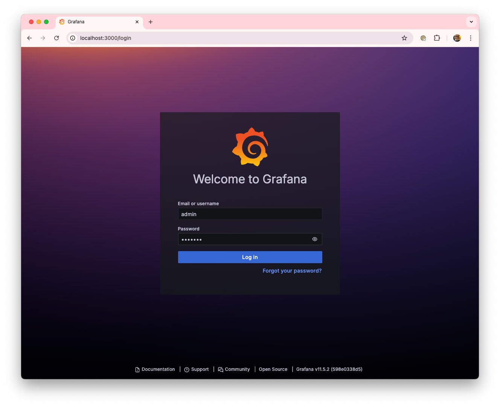
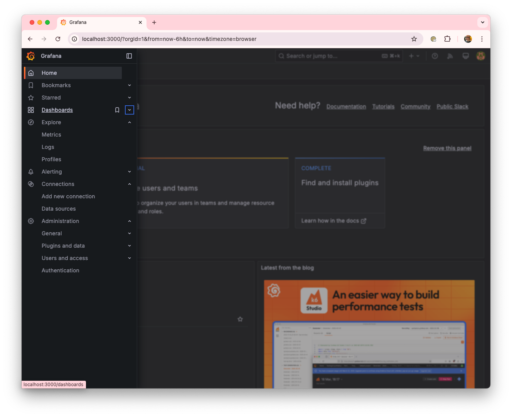
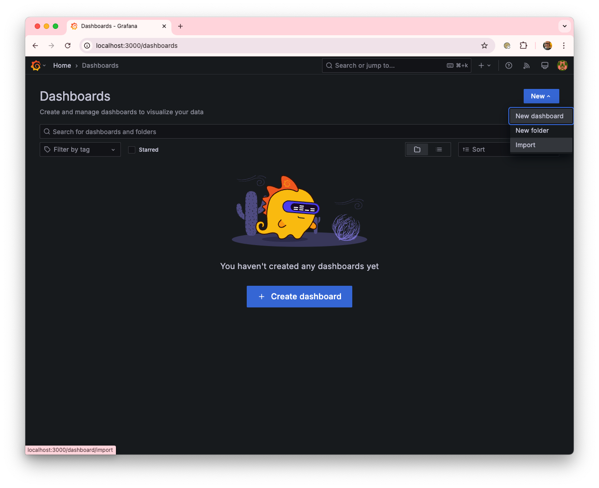
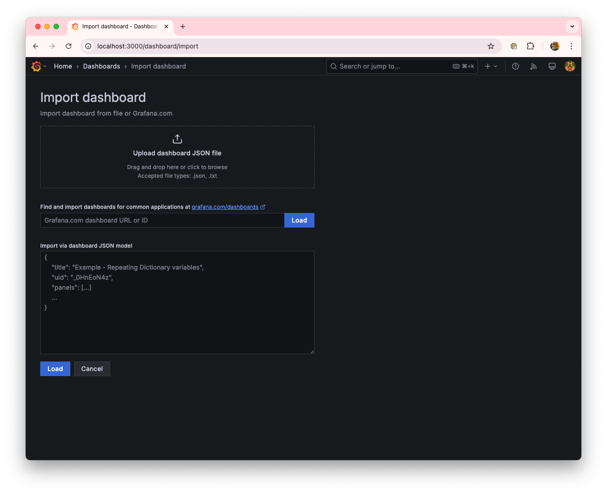
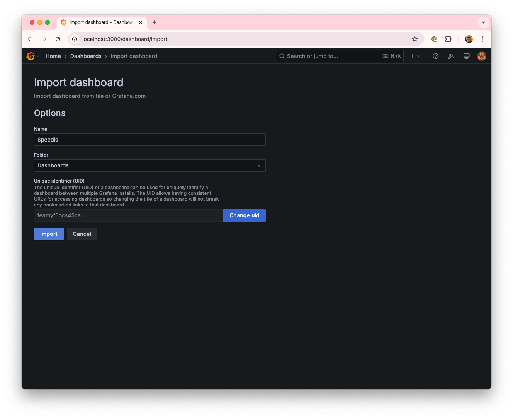
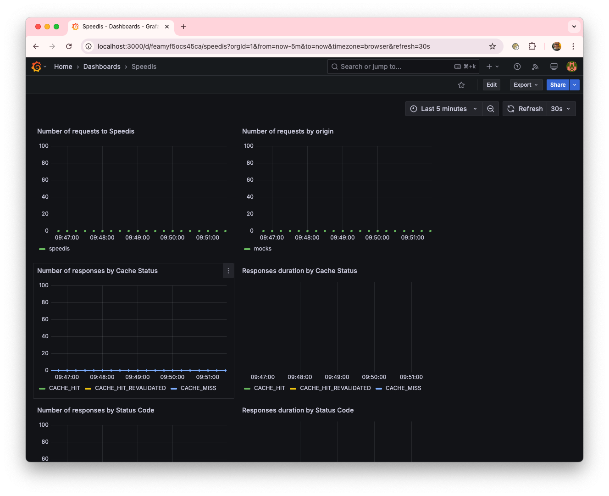

# Grafana dashboard
The project incorporates a very simple Grafana dashboard to monitor KPIs regarding the cache behavior.
Below are the steps to use it.

1. **Access Grafana at http://localhost:3000 (User: admin, Password: grafana).**

2. **Select the Dashboards option.**

3. **Click on Import a new Dashboard.**

4. **Upload the contents of the ./conf/grafana/Speedis-dashboard.json file.**

5. **Confirm the import.**

6. **Once imported, the dashboard will be available for use.**

There are several Grafana dashboards available to monitor the HAProxy component.
By following the steps above, you can easily import one of them.
As an example: [HAProxy 2 Full](https://grafana.com/grafana/dashboards/12693-haproxy-2-full/).

