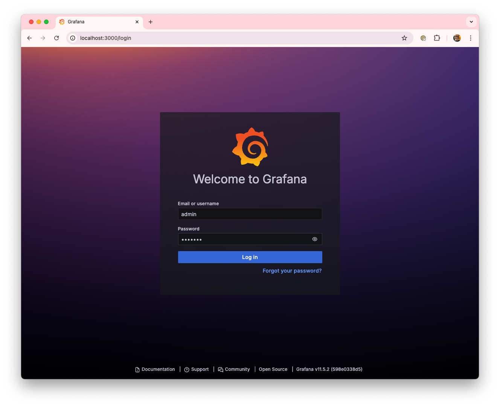
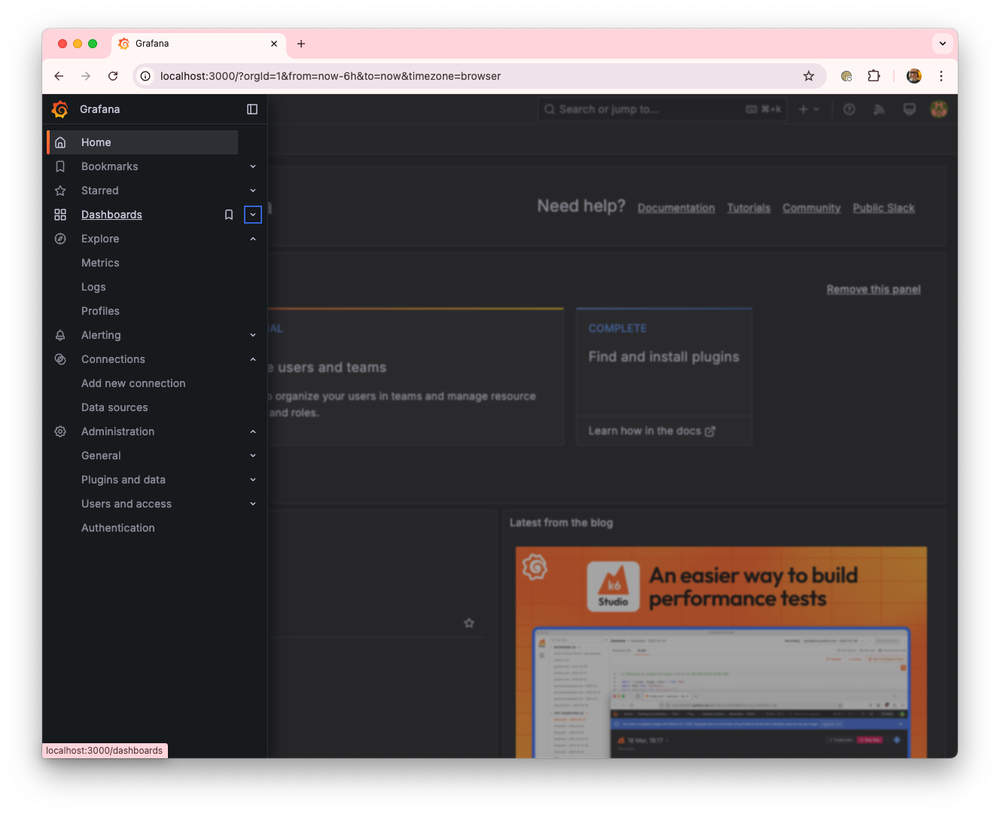
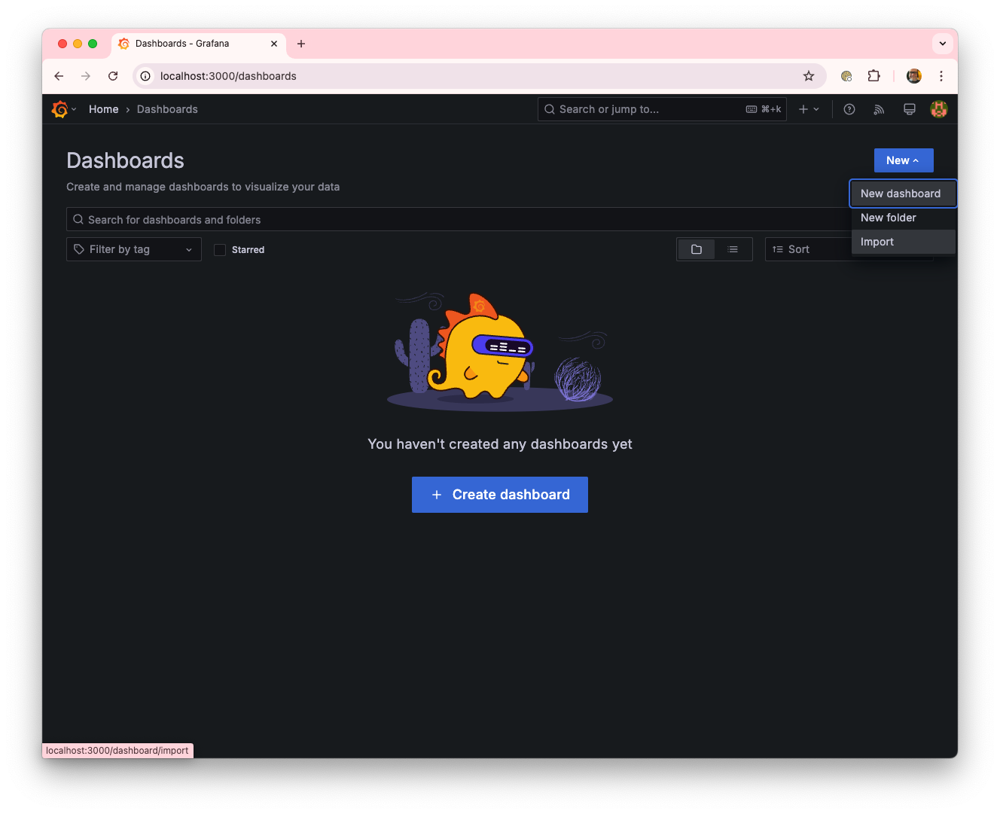
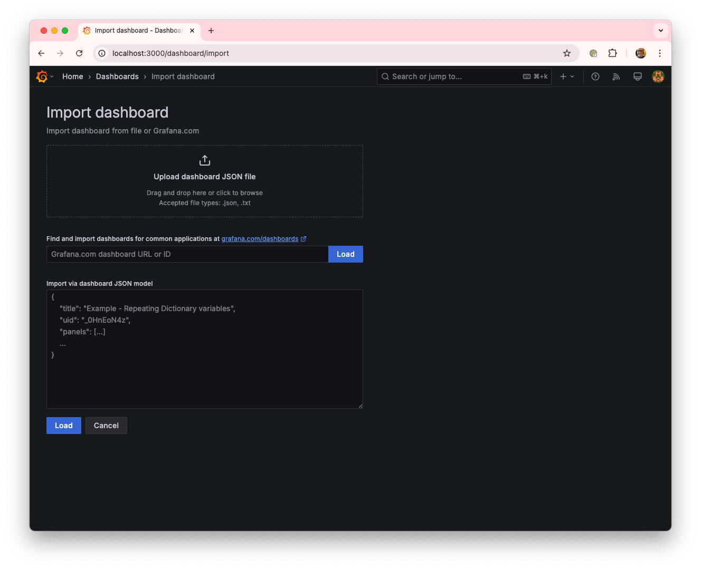
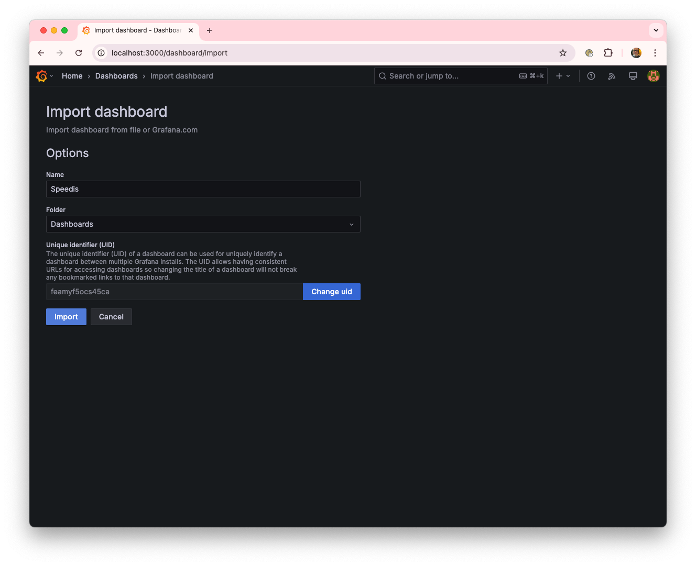
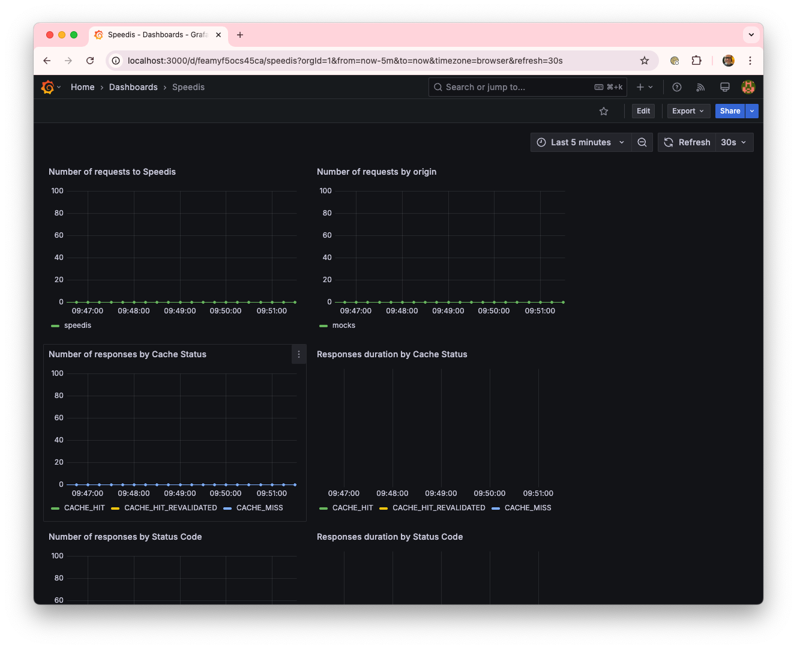

# Grafana dashboard
The project incorporates a very simple Grafana dashboard to monitor KPIs regarding the cache behavior.
Below are the steps to use it.

1. **Access Grafana at http://localhost:3000 (User: admin, Password: grafana).**

2. **Select the Dashboards option.**

3. **Click on Import a new Dashboard.**

4. **Upload the contents of the ./conf/grafana/Speedis-dashboard.json file.**

5. **Confirm the import.**

6. **Once imported, the dashboard will be available for use.**

There are several Grafana dashboards available to monitor the HAProxy component.
By following the steps above, you can easily import one of them.
As an example: [HAProxy 2 Full](https://grafana.com/grafana/dashboards/12693-haproxy-2-full/).

## Available metrics

Speedis exposes Prometheus metrics on a dedicated HTTP server (default port `3003`, path `/metrics`). The metrics are aggregated across all cluster workers via [`prom-client`](https://github.com/siimon/prom-client)'s `AggregatorRegistry`, on top of the default Node.js process metrics (event-loop lag, GC, RSS, etc.).

| Metric | Type | Labels | Description |
|--------|------|--------|-------------|
| `speedis_tcp_connections` | Gauge | `worker_id` | Active TCP connections per cluster worker. Collected on every scrape via `server.getConnections()`. |
| `speedis_http_requests_total` | Counter | `origin`, `target`, `method` | Total HTTP requests received by Speedis. `target` is one of `cache` (request matched a cacheable URL), `proxy` (forwarded straight to the origin) or `purge` (DELETE on the purge prefix). |
| `speedis_http_responses_total` | Counter | `origin`, `target`, `statusCode`, `cacheStatus` | Total HTTP responses emitted by Speedis. `cacheStatus` carries the prefix extracted from the `x-speedis-cache-status` header (see [CacheStatus.md](./CacheStatus.md) for the full list of values); for `target=proxy` and `target=purge` it is `Unknown`. |
| `speedis_http_responses_duration` | Histogram | `origin`, `target`, `statusCode`, `cacheStatus` | Distribution of `reply.elapsedTime` (milliseconds, from request received to response sent). Same label semantics as `speedis_http_responses_total`. |

Per-origin metrics can be disabled with `"metrics": false` in the origin configuration (see [Configuration.md](./Configuration.md#origin-configuration)). The metrics server itself is controlled by the top-level `metricServerPort` and `metricServerLogLevel` fields.

The bundled Grafana dashboard (`./conf/grafana/Speedis-dashboard.json`) uses these four metrics together with the `cacheStatus` label (see [CacheStatus.md](./CacheStatus.md)) to break down hit ratio, latency percentiles and origin pressure.

