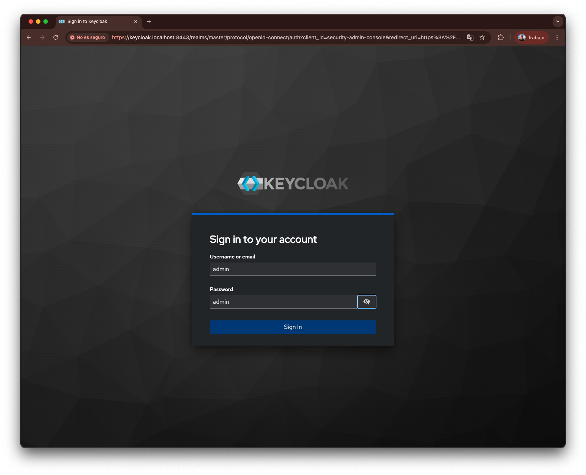
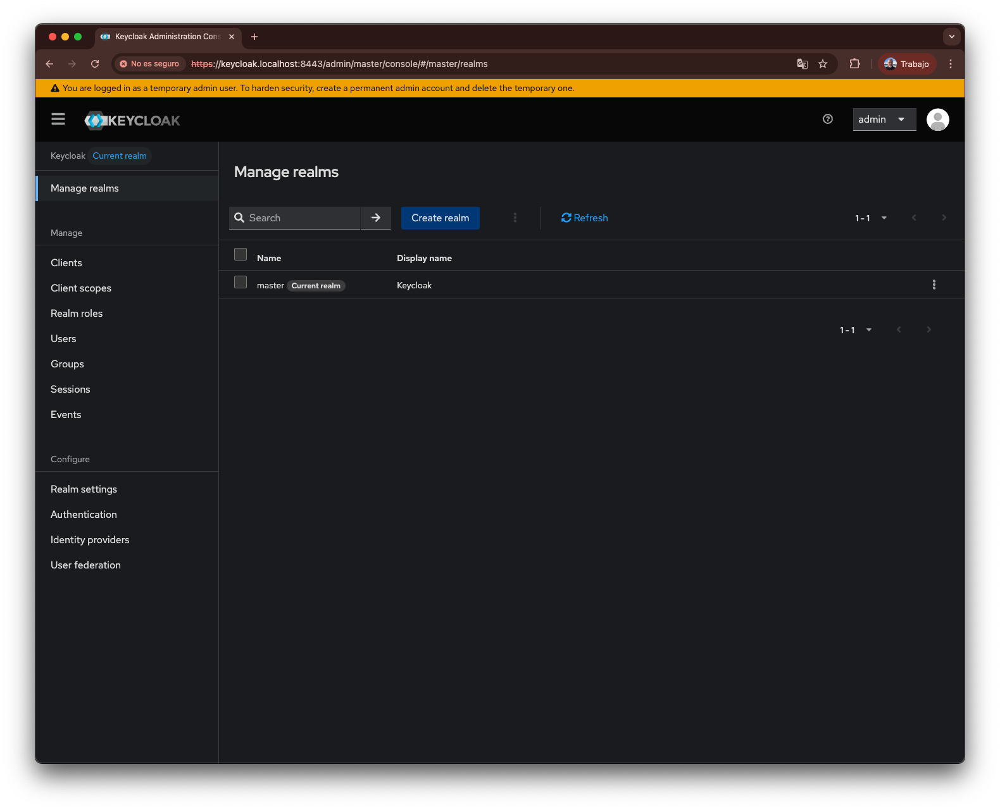
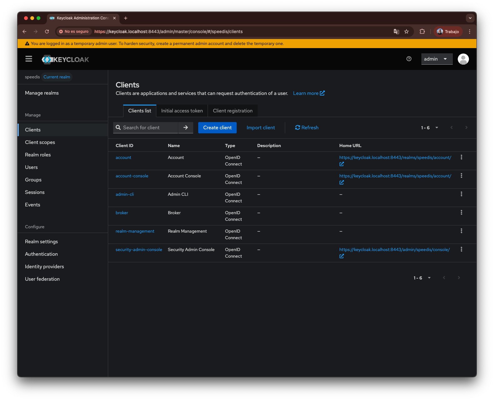
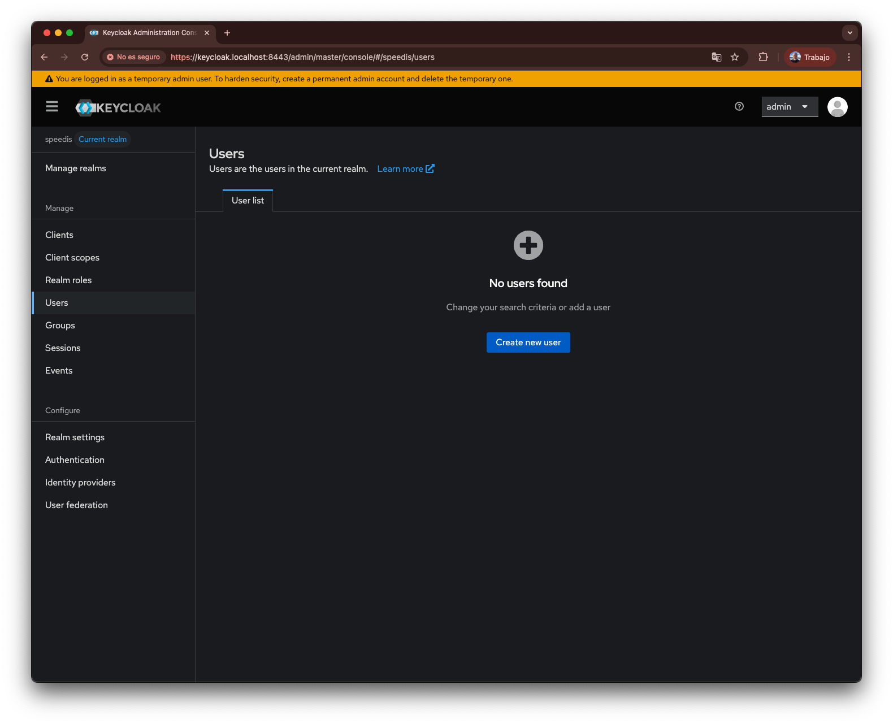
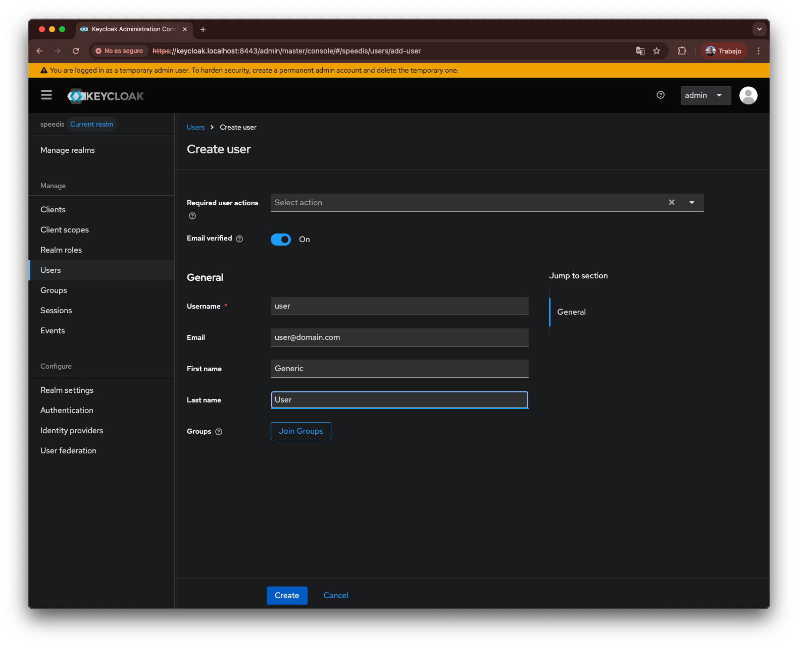
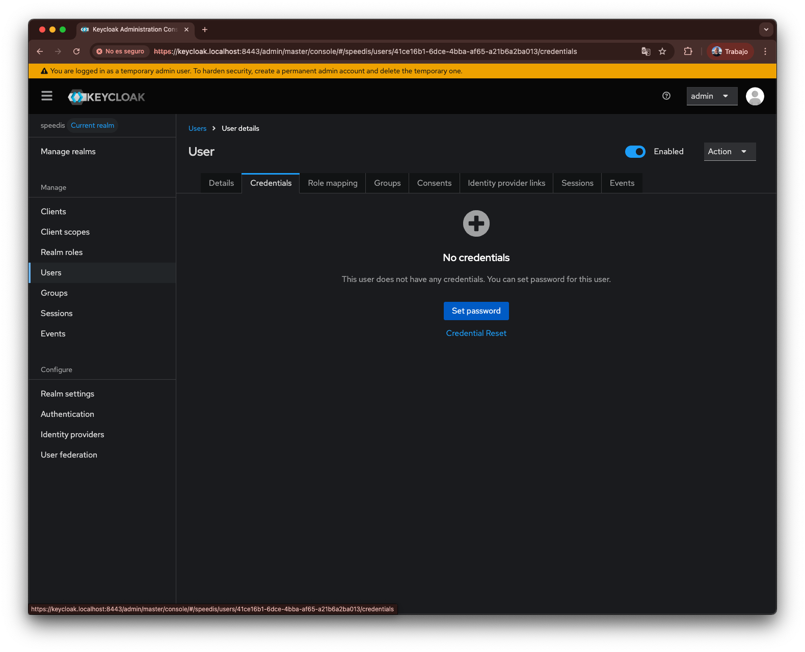
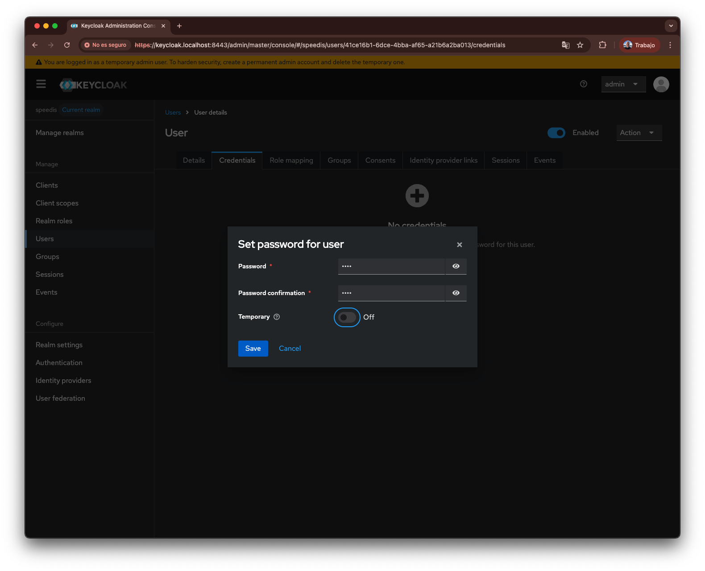
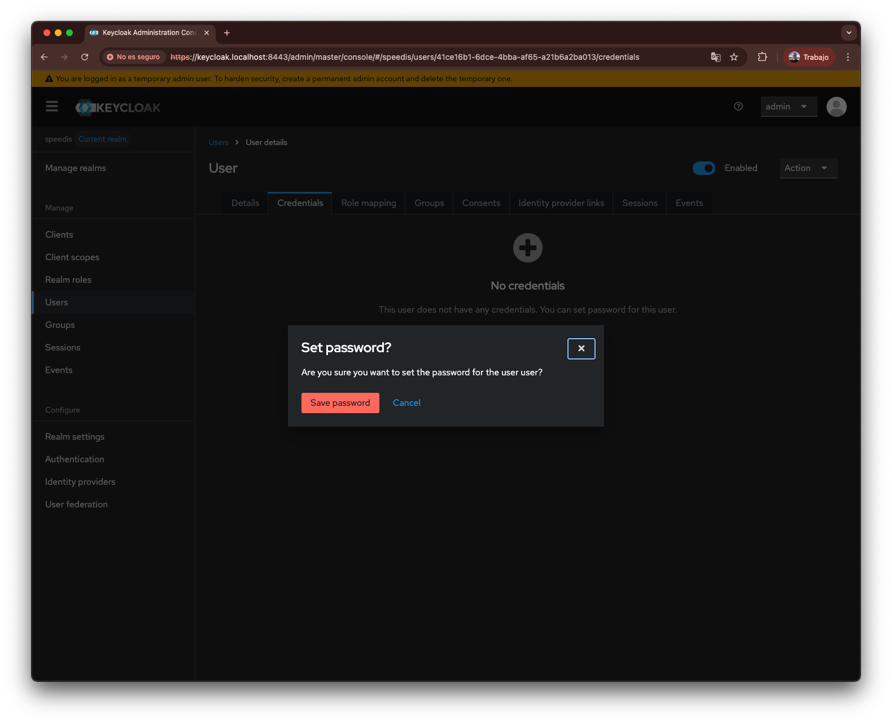
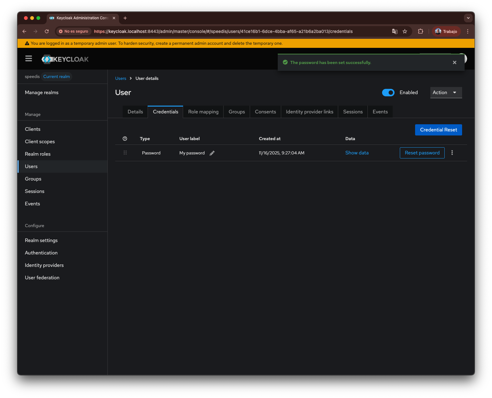

# Grafana dashboard
The project incorporates Keycloak, an Identity and Access Management (IAM) server, is included to support OAuth2 integration within Speedis.
In the sample mocks configuration, Keycloak is used, and it must be properly configured before running Speedis.
Below are the steps to configure it.
If you want to learn more about concepts such as Realm, Client, and others, you can refer to the [Keycloak documentation](https://www.keycloak.org/documentation)

1. **Access Keycloak at https://keycloak.localhost:8443 (User: admin, Password: admin).**

2. **Create the Speedis Realm.**

In the left-hand menu, click on “Manage realms”, then click the “Create realm” button.

Enter the name of the realm (it must be speedis) and click Create.

Once created, the new realm will appear in the list of realms.

3. **Import the client configuration.**

**Make sure that speedis is shown at the top of the left menu as the current realm.**

In the left-hand menu, click on “Clients”, then click the “Import client” link.

Upload the contents of the ./3rparties/keycloak/speedis-client.json file into the Resource file field and click Save.

Once created, the new realm will appear in the list of clients.

4. **Create an user.**

**Make sure that speedis is shown at the top of the left menu as the current realm.**

In the left-hand menu, click “Users”, then click the “Create new user” button.

Enter the user details and click Create.

Once the user has been created, open the “Credentials” tab and click “Set Password”.

Enter the new password for the user.

Confirm the operation.

The new password should now appear in the user’s list of credentials.

